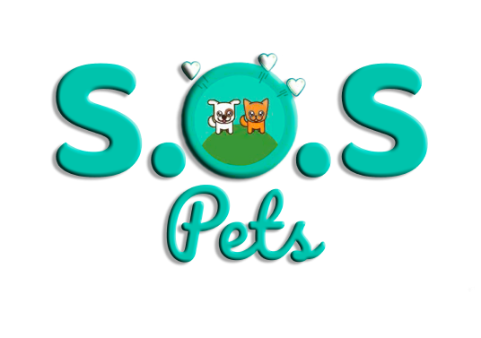
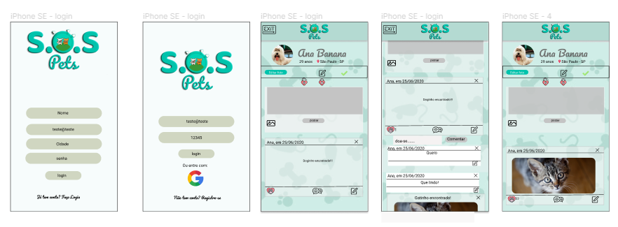
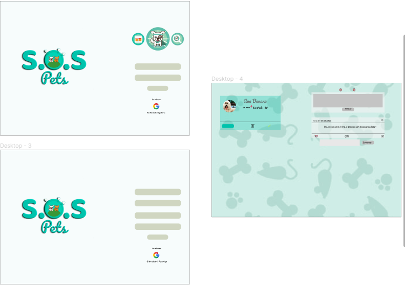
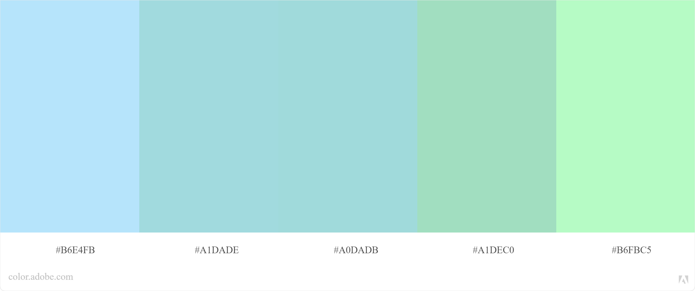
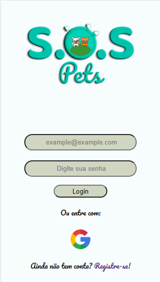
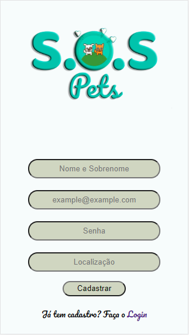
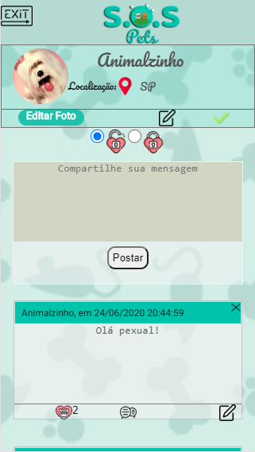
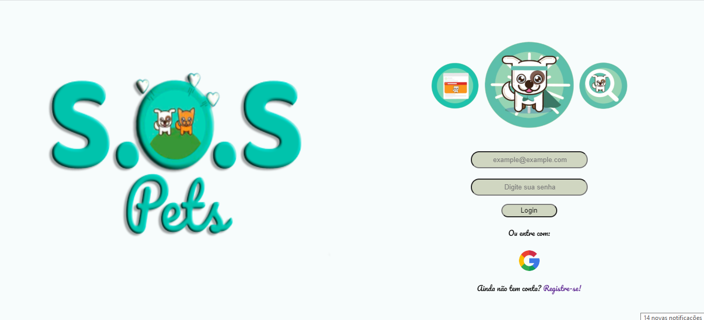
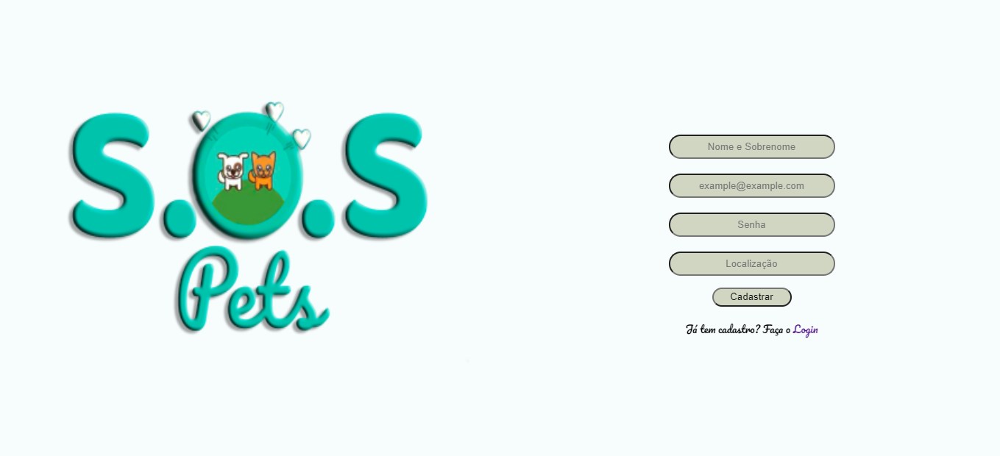
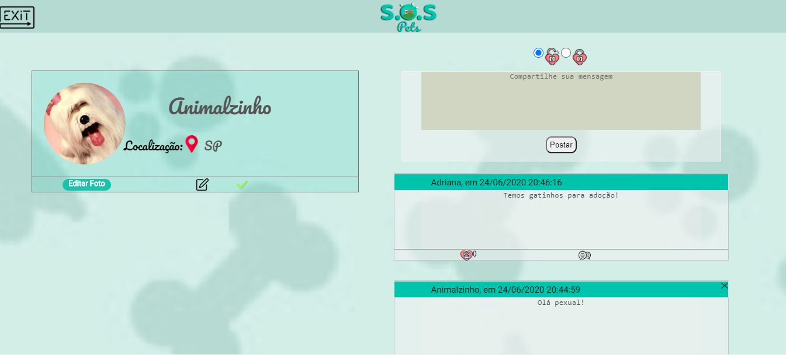

 

***

### Índice

* [1. Apresentação](#1-Apresentação)
* [2. Funcionamento](#2-funcionamento)
* [3. O Objetivo](#3-o-objetivo)
* [4. Planejamento](#4-planejamento)
* [5. Desenvolvimento Front End](#5-desenvolvimento-front-end)
* [6. Desenvolvedoras](#6-desenvolvedoras)

***

## 1. Apresentação

A **S.O.S Pets** é uma rede social que tem por obejtivo atender as pessoas que desejam trocar experiências com atividades voltadas a divulgação de animais abandonados, perdidos e que necessitam ser adotados. 

Esta ferramenta proporcionará um aumento no número de contatos dos usuários, gerando mais facilidade para encontrar pessoas dispostas a realizar adoções conscientes ou que estejam interessadas em ajudar.
Os usuários terão este canal único para encontrar o que precisam, seja um novo amigo pet ou troca de experiencias e objetivos em comum.

Projeto: [S.O.S Pets](https://sospetslab.web.app)

## 2. Funcionamento

Assim que o usuário acessa a página ele é direcionado para *Home* que necessita da autenticação via e-mail ou Google para cadastro do usuário. Se ele não obtiver cadastro ele pode acessar o *Register* para se cadastrar de acordo com as informações solicitadas. Após a autenticação ou cadastro, o usuário é redirecionado para o *Feed*, podendo compartilhar suas ideias, excluí-las, editar, curtir ou comentar em seu post e nos dos demais usuários. O usuário também consegue editar em seu perfil o seu nome e sua localização, além de adicionar uma foto no perfil.

## 3. O Objetivo

O objetivo deste projeto é construir uma aplicação em **SPA** *Single-Page Application*, implementado um sistema de rotas de páginas (sem uso de bibliotecas externas). A navegação na aplicação rola toda em uma única página e todo o conteúdo é carregado de uma vez ou obtido dinâmicamente.

A aplicação foi desenvolvida com enfoque em **mobile first** que é um conceito aplicado em projetos web onde o foco inicial da arquitetura e desenvolvimento é direcionado aos dispositivos móveis e em seguida para os desktops.

O projeto também utiliza a **persistência de dados** a estrutura dos dados foi desenhada de forma à consultá-los, atualizá-los, modificá-los e eliminá-los segundo os requerimentos do usuário. Para isso utilizamos a ferramenta do **Firebase**.

Portanto, nesta aplicação usamos HTML5, CCS3, JavaScript (ES6+) e Firebase.

## 4. Planejamento

Para ralizarmos o planejamento de nossa aplicação, utilizamos as determinadas ferramentas para otimização do projeto.

### Protótipo
Por meio da ferramenta *Figma*, elaboramos nosso protótipo no modelo *mobile first* e *Desktop*
 

 

### Paleta de Cores
Esta foi a paleta de cores escolhida para utilizar na nossa aplicação.
 

### Trello
Foi utilizada a ferramenta Trello para determinar o que entregaríamos nas *Sprints*

## 5. Desenvolvimento Front-end

* Tela Mobile 

 

 

 

* Tela Desktop 

## 6. Desenvolvedoras

* [Adriana Silva](https://github.com/sjadriana)
* [Alessandra Marinho](https://github.com/alessandramarinho)
* [Camila Roque](https://github.com/milaroque)
